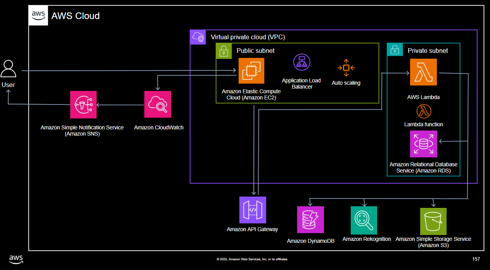

# 🚀 Sobre o Projeto
Este projeto consiste na criação de uma arquitetura em nuvem escalável e resiliente utilizando Amazon Web Services (AWS), com foco na análise automatizada de imagens por meio do Amazon Rekognition.

## ✅ Alta disponibilidade.
## ✅ Escalabilidade automática.
## ✅ Desacoplamento de componentes.
## ✅ Minimização do gerenciamento de infraestrutura.

# 🏗️ Arquitetura e Fluxo
- Acesso do frontend localizado no Amazon EC2.

- Monitoramento das instâncias pelo CloudWatch

- Notificação pelo SNS

- Requisições do frontend processadas pelo API Gateway.

- O API Gateway redireciona as requisições para o Lambda.

- A função Lambda executa as seguintes ações:

    Conexão ao bucket criado no S3

    Conecta-se aos bancos DynamoDB e RDS

    Ativa a utilização do Rekognition

    Recebe as imagens

    Realiza operações de upload/download para o Amazon S3 das imagens recebidas.

    Gera a criação de Labels de imagens por meio do Rekognition

    Salva as labels geradas em ambos os bancos de dados

    Retorna no Frontend as labels geradas

# ⚡ Função Lambda
```python
import json
import boto3
import uuid
import base64
import mysql.connector
from botocore.exceptions import ClientError

# Inicializa clientes AWS
s3 = boto3.client('s3')
rekog = boto3.client('rekognition')
dynamodb = boto3.resource('dynamodb')

# Nomes da tabela e do bucket
TABLE_NAME = 'Lab-DynamoDB'
BUCKET_NAME = 'lab-arquitetura-s3-guilherme-camargo-2025'

# Função para conectar ao MySQL
def get_db_connection():
    try:
        return mysql.connector.connect(
            user='admin',
            password='senai123',
            host='database-mysql.cjziletdu6o3.us-east-1.rds.amazonaws.com',
            database='images'
        )
    except Exception as e:
        print(f"Database connection failed: {str(e)}")
        return None

def lambda_handler(event, context):
    try:
        # Trata entrada vinda via API Gateway
        body = json.loads(event['body']) if 'body' in event else event

        image_data = body.get('image_data')
        filename = body.get('filename')

        # Valida se a imagem foi enviada
        if not image_data:
            return {
                'statusCode': 400,
                'body': json.dumps({'error': 'Missing image_data'}, indent=4)
            }

        # Decodifica a imagem de base64
        image_bytes = base64.b64decode(image_data)

        # Faz upload da imagem para o S3
        s3.put_object(
            Bucket=BUCKET_NAME,
            Key=filename,
            Body=image_bytes,
            ContentType='image/jpeg'
        )

        # Detecta labels na imagem usando Rekognition
        response = rekog.detect_labels(
            Image={'S3Object': {'Bucket': BUCKET_NAME, 'Name': filename}},
            MaxLabels=10,
            MinConfidence=90
        )
        labels = [label['Name'] for label in response['Labels']]

        # Armazena metadados no DynamoDB
        table = dynamodb.Table(TABLE_NAME)
        item = {
            'id': str(uuid.uuid4()),
            's3_key': filename,
            'labels': labels
        }
        table.put_item(Item=item)

        # Conecta ao banco MySQL
        cnx = get_db_connection()
        mysql_data = []
        if cnx:
            cursor = cnx.cursor()

            # Cria a tabela se não existir
            cursor.execute('SHOW TABLES LIKE "images"')
            if not cursor.fetchone():
                cursor.execute("""
                    CREATE TABLE images (
                        id VARCHAR(36) PRIMARY KEY, 
                        s3_key VARCHAR(255), 
                        labels TEXT
                    )
                """)
                cnx.commit()

            # Evita inserir imagens duplicadas
            cursor.execute("SELECT id FROM images WHERE s3_key = %s", (filename,))
            existing = cursor.fetchone()

            if not existing:
                # Insere dados no MySQL
                sql = "INSERT INTO images (id, s3_key, labels) VALUES (%s, %s, %s)"
                cursor.execute(sql, (item['id'], item['s3_key'], json.dumps(item['labels'])))
                cnx.commit()

            # Recupera todos os registros da tabela
            cursor.execute("SELECT id, s3_key, labels FROM images")
            rows = cursor.fetchall()

            for row in rows:
                mysql_data.append({
                    'id': row[0],
                    's3_key': row[1],
                    'labels': json.loads(row[2])
                })

            cursor.close()
            cnx.close()
        else:
            print("Falha ao conectar no MySQL.")

        # Retorna resposta com sucesso
        return {
            'statusCode': 200,
            'body': json.dumps({
                'message': 'Imagem processada com sucesso',
                'labels': labels,
                's3_key': filename,
                'mysql_table': mysql_data
            }, indent=4)
        }

    # Tratamento de erros específicos da AWS
    except ClientError as e:
        print(e)
        return {
            'statusCode': 500,
            'body': json.dumps({'error': str(e)}, indent=4)
        }
    # Tratamento de quaisquer outros erros
    except Exception as ex:
        print(ex)
        return {
            'statusCode': 500,
            'body': json.dumps({'error': str(ex)}, indent=4)
        }

```
# 🧰 Tecnologias e Serviços AWS

| Categoria                     | Serviço AWS Utilizado                                          |
|--------------------------------|---------------------------------------------------------------|
| Computação                    | Amazon EC2, Amazon Lambda                                     |
| Bancos de Dados               | Amazon RDS (MySQL), Amazon DynamoDB                           |
| Armazenamento                 | Amazon S3                                                     |
| Balanceamento e Escalabilidade| Elastic Load Balancer (ELB), Auto Scaling                     |
| API e Integração              | Amazon API Gateway                                            |
| Análise de Imagem             | Amazon Rekognition                                            |
| Rede e Segurança              | Amazon VPC (customizada com subnets públicas e privadas)      |

